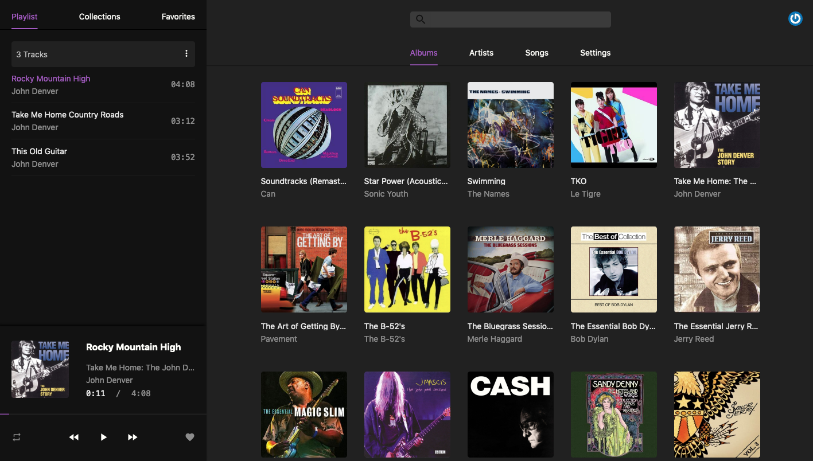

<p align='center'>
  
</p>

# Black candy
[](https://travis-ci.org/aidewoode/black_candy)

Black candy is a self hosted music streaming server built with Rails and Stimulus. The goal of the project is to create a real personal music center.

## Screenshot


## Demo

Try the [demo](http://178.62.101.174/) (email: foo@bar.com, password: foobar)

Note: Please do not change the password on demo, avoid others can not visit it.

List for all music on the demo:

- Kurt Vile - Live at WFMU on Talk's Cheap 8/11/2008 (licensed under a [Attribution-NonCommercial-ShareAlike 3.0 International License](https://creativecommons.org/licenses/by-nc-sa/3.0/))
- Steve Gunn - Live at WFMU's Monty Hall: Oct 18, 2015 (licensed under a [Creative Commons Attribution-NonCommercial-NoDerivatives 4.0 License](https://creativecommons.org/licenses/by-nc-nd/4.0/)) 

If like their music, you can buy their albums to support them.

## Getting started

Black candy use docker for simplify deployment, development and test process. So you should install docker and docker-compose first.

Black candy support mp3, m4a, ogg, flac and wav formats now.

## Installation

Black candy has built [docker images](https://hub.docker.com/r/blackcandy/blackcandy).

First, you need clone this project to your server. 

```
$ git clone https://github.com/aidewoode/black_candy.git
```

Second, set `BLACK_CANDY_MEDIA_PATH` and `BLACK_CANDY_SECRET_KEY_BASE` environment variable on your sever and point `BLACK_CANDY_MEDIA_PATH` to the readable directory on your server to store your music files.

```shell
# Like this
$ export BLACK_CANDY_MEDIA_PATH="/example_media_path"
$ export BLACK_CANDY_SECRET_KEY_BASE="your_secret_key"
```

Then, you should setup database

```shell
$ make production_setup 
```

Finally run:

```shell
$ docker-compose up -d

# or

$ make production_run
```

That's all. 

You can use initial admin user to login (email: admin@admin.com, password: foobar).

You can also change `docker-compose.yml` for your own needs.

## Development

```shell
# Clone the repo
$ git clone https://github.com/aidewoode/black_candy.git

# Setup development environment
$ make dev_setup

# Runing development server
$ make dev_run

# Stop development server
$ make dev_stop

# Into development shell
$ make dev_shell
```

## Test

```shell
# Setup test environment
$ make test_setup

# Runing test
$ make test_run

# Runing lint
$ make test_run_lint

# Into test shell
$ make test_shell
```

## Integrations

Black candy support get artist and album image from Discogs API. You can create a API token from Discogs and set Discogs token on Setting page to enable it.
