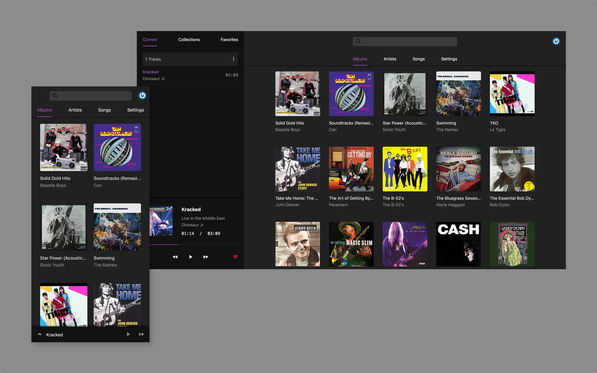
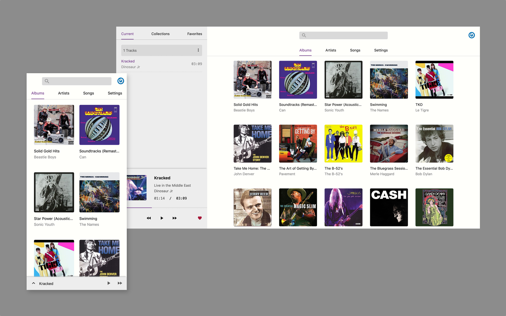

<p align='center'>
  
</p>

# Black candy
[](https://travis-ci.org/aidewoode/black_candy)

Black candy is a self hosted music streaming server built with Rails and Stimulus. The goal of the project is to create a real personal music center.

## Screenshot





## Getting started

Black candy use docker for simplify deployment, development and test process. So you should install docker and docker-compose first.

Black candy support mp3, m4a, ogg, opus, flac and wav formats now.

## Installation

Black candy has built [docker images](https://hub.docker.com/r/blackcandy/blackcandy).

First, you need clone this project to your server. 

```
$ git clone https://github.com/aidewoode/black_candy.git
```

Second, set `BLACK_CANDY_MEDIA_PATH` and `BLACK_CANDY_SECRET_KEY_BASE` environment variable on your sever and point `BLACK_CANDY_MEDIA_PATH` to the readable directory on your server to store your music files.

```shell
# Like this
$ export BLACK_CANDY_MEDIA_PATH="/example_media_path"
$ export BLACK_CANDY_SECRET_KEY_BASE="your_secret_key"
```

Then, you should setup database

```shell
$ make production_setup 
```

Finally run:

```shell
$ docker-compose up -d

# or

$ make production_run
```

That's all. 

You can use initial admin user to login (email: admin@admin.com, password: foobar).

You can also change `docker-compose.yml` for your own needs.

## Setup SSL

Black candy can use Let’s Encrypt to get certificate. If you want to enable ssl, you sould make sure your server IP associate with your domain on DNS first.

Then you need set `BLACK_CANDY_DOMAIN_NAME` and `BLACK_CANDY_DOMAIN_EMAIL` environment variable on your sever.

```shell
$ export BLACK_CANDY_DOMAIN_NAME="example.com"
$ export BLACK_CANDY_DOMAIN_EMAIL="youremail@email.com"
```

Then set ssl certificate 

```shell
$ make production_set_ssl
```

After set ssl certificate successfully, you should set `BLACK_CANDY_USE_SSL` environment variable to true.

```shell
$ export BLACK_CANDY_USE_SSL="true"
```

Finally, restart Black candy

```shell
$ make production_restart
```

## Development

```shell
# Clone the repo
$ git clone https://github.com/aidewoode/black_candy.git

# Setup development environment
$ make dev_setup

# Runing development server
$ make dev_run

# Stop development server
$ make dev_stop

# Into development shell
$ make dev_shell
```

## Test

```shell
# Setup test environment
$ make test_setup

# Runing test
$ make test_run

# Runing lint
$ make test_run_lint

# Into test shell
$ make test_shell
```

## Integrations

Black candy support get artist and album image from Discogs API. You can create a API token from Discogs and set Discogs token on Setting page to enable it.
